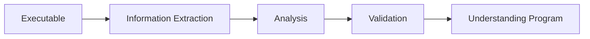

# Week 01 — Introduction to Reverse Engineering

---

# Ringkasan

Pada pertemuan pertama, saya mempelajari konsep dasar **Reverse Engineering (RE)** sebagai fondasi awal sebelum memasuki materi yang lebih teknis. Materi pada minggu ini berfokus pada pemahaman mengenai definisi reverse engineering, perbedaannya dengan forward engineering, tahapan umum dalam proses reverse engineering, serta penerapannya dalam dunia teknologi dan keamanan siber.

Selain itu, saya juga mulai mengenal beberapa tools yang umum digunakan dalam proses reverse engineering seperti IDA Free, Ghidra, dan x64dbg. Materi ini memberikan gambaran awal mengenai bagaimana sebuah executable dapat dianalisis untuk memahami cara kerja internalnya tanpa memiliki source code asli.

---

# Pembahasan Materi

## 1. Forward Engineering vs Reverse Engineering

Dalam pengembangan perangkat lunak, proses yang umum dilakukan adalah **Forward Engineering**, yaitu membangun software mulai dari tahap perancangan, implementasi, hingga menghasilkan program yang siap dijalankan.

Secara sederhana alur forward engineering dapat digambarkan sebagai berikut:

```text id="a1b2c3"
Source Code
     │
     │ Compile
     ▼
Executable / Binary
     │
     │ Load to Memory
     ▼
Program Running
```

Pada proses ini, programmer menulis source code menggunakan bahasa pemrograman tertentu seperti C, C++, Java, atau Python. Setelah itu, source code dikompilasi atau diinterpretasikan sehingga menjadi program yang dapat dijalankan.

Sebaliknya, **Reverse Engineering** memulai analisis dari executable atau binary yang sudah jadi untuk memahami bagaimana program tersebut bekerja.

```text id="d4e5f6"
Executable
     │
     │ Analysis
     ▼
Assembly Code
     │
     │ Decompile
     ▼
Pseudo Code
```

Tujuan utama reverse engineering bukan untuk mendapatkan source code asli secara sempurna, melainkan memahami logika program, struktur internal, serta mekanisme kerja software tersebut.

---

## 2. Tahapan Reverse Engineering

Secara umum, proses reverse engineering terdiri dari beberapa tahapan utama.

### Information Extraction

Tahap pertama adalah mengumpulkan informasi dari binary tanpa memodifikasi file tersebut. Informasi yang dapat dikumpulkan antara lain:

* Strings
* Import Function
* Export Function
* Header File
* Metadata
* Resource
* Struktur Binary

Tahap ini bertujuan memperoleh gambaran awal mengenai program yang akan dianalisis.

---

### Analysis / Modelling

Setelah informasi awal diperoleh, langkah berikutnya adalah melakukan analisis lebih mendalam untuk memahami alur program.

Hal yang biasanya dianalisis antara lain:

* Flow eksekusi program
* Fungsi-fungsi penting
* Algoritma yang digunakan
* Mekanisme autentikasi
* Teknik proteksi

Tahap ini menjadi inti dari reverse engineering karena di sinilah proses memahami logic program dilakukan.

---

### Validation

Tahap terakhir adalah memvalidasi hasil analisis menggunakan berbagai pendekatan seperti:

* Debugging
* Dynamic Analysis
* Sandbox
* Proof of Concept

Validasi penting untuk memastikan bahwa hasil analisis sesuai dengan perilaku program saat dijalankan.

---

## 3. Mengapa Reverse Engineering Penting?

Reverse engineering memiliki peran yang sangat penting dalam berbagai bidang, khususnya cybersecurity.

### Malware Analysis

Reverse engineering membantu security researcher memahami cara kerja malware, teknik penyebaran, persistence mechanism, dan payload yang dijalankan.

### Vulnerability Assessment

Reverse engineering dapat digunakan untuk menemukan celah keamanan pada software yang tidak terlihat melalui pengujian biasa.

### Software Maintenance

Ketika source code tidak tersedia, reverse engineering dapat membantu developer atau analyst memahami struktur aplikasi.

### Digital Forensics

Dalam investigasi insiden keamanan, reverse engineering membantu mengidentifikasi perilaku software berbahaya.

---

## 4. Studi Kasus Reverse Engineering

Salah satu contoh penerapan reverse engineering yang terkenal adalah analisis ransomware **WannaCry**.

Melalui reverse engineering, peneliti keamanan berhasil memahami:

* Cara malware menyebar
* Mekanisme enkripsi file
* Aktivitas jaringan malware
* Teknik persistence yang digunakan

Dari studi kasus ini saya mulai memahami bahwa reverse engineering memiliki dampak besar dalam mitigasi ancaman keamanan siber.

---

## 5. Tools Reverse Engineering

Beberapa tools yang umum digunakan dalam reverse engineering antara lain:

| Tools     | Fungsi                      |
| --------- | --------------------------- |
| IDA Free  | Interactive Disassembler    |
| Ghidra    | Disassembler dan Decompiler |
| x64dbg    | Dynamic Debugger            |
| HxD       | Hex Editor                  |
| Wireshark | Network Analysis            |

Setiap tools memiliki fungsi dan keunggulan masing-masing tergantung kebutuhan analisis.

---

# Diagram Proses Reverse Engineering



---

# Insight Minggu Ini

Dari materi minggu pertama ini, saya memahami bahwa reverse engineering merupakan proses analisis yang sistematis untuk memahami cara kerja sebuah software dari executable atau binary yang sudah jadi. Reverse engineering bukan hanya sekadar membongkar program, tetapi juga melibatkan analisis yang terstruktur mulai dari pengumpulan informasi hingga validasi hasil analisis.

Saya juga mulai memahami bahwa bidang ini memiliki peran yang sangat penting dalam dunia cybersecurity, terutama untuk malware analysis, vulnerability assessment, dan digital forensics.

---

# Tools yang Dipelajari

* IDA Free
* Ghidra
* x64dbg
* HxD
* Wireshark

# Refleksi Pembelajaran

## Apa yang Saya Pahami

Setelah mempelajari materi minggu pertama, saya memahami bahwa reverse engineering adalah proses untuk menganalisis software tanpa memiliki source code asli. Saya juga memahami perbedaan mendasar antara forward engineering dan reverse engineering serta mengetahui tahapan utama dalam proses analisis executable.

Saya mulai mengenal berbagai tools yang umum digunakan untuk mendukung proses reverse engineering, baik untuk static analysis maupun dynamic analysis.

## Apa yang Masih Membingungkan

Saya masih ingin memahami bagaimana sebuah disassembler dapat menerjemahkan machine code menjadi assembly code yang dapat dibaca manusia. Selain itu, saya juga masih penasaran bagaimana decompiler menghasilkan pseudo-code yang menyerupai source code asli.

## Kesimpulan Pribadi

Materi minggu pertama memberikan fondasi yang sangat penting untuk memahami reverse engineering secara keseluruhan. Dengan memahami konsep dasar, tahapan, dan tools yang digunakan, saya memiliki gambaran awal mengenai proses analisis software yang akan dipelajari lebih mendalam pada pertemuan berikutnya.

---
