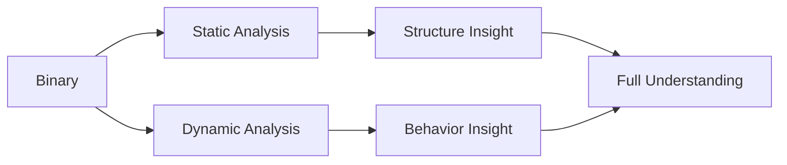

# Week 02 — Static Analysis vs Dynamic Analysis

---

# Ringkasan

Pada pertemuan kedua, saya mempelajari dua pendekatan utama yang digunakan dalam Reverse Engineering, yaitu **Static Analysis** dan **Dynamic Analysis**. Kedua metode ini merupakan fondasi penting dalam proses analisis binary maupun malware karena masing-masing memiliki tujuan, kelebihan, dan keterbatasan yang berbeda.

Materi minggu ini berfokus pada perbedaan antara kedua pendekatan tersebut, tools yang digunakan, serta bagaimana keduanya saling melengkapi dalam proses analisis sebuah executable. Dari materi ini saya mulai memahami bahwa analisis yang baik umumnya tidak hanya bergantung pada satu pendekatan, tetapi menggunakan kombinasi static analysis dan dynamic analysis.

---

# Pembahasan Materi

## 1. Static Analysis

Static Analysis adalah proses menganalisis suatu file executable atau binary tanpa menjalankannya. Metode ini digunakan untuk mengumpulkan informasi awal mengenai struktur internal program dengan cara menginspeksi isi file secara langsung.

Informasi yang biasanya diperoleh melalui static analysis meliputi:

* File header
* Strings
* Import table
* Export table
* Resources
* Section
* Function references

Secara sederhana, alur static analysis dapat digambarkan sebagai berikut:

```text id="wk2a11"
Binary File
    │
    │ Inspect
    ▼
Strings / Header / Imports
    │
    │ Analyze
    ▼
Program Understanding
```

Keunggulan static analysis:

* Lebih aman karena file tidak dijalankan
* Cocok untuk triage awal
* Membantu memahami struktur binary
* Efektif untuk identifikasi IOC

Namun, static analysis juga memiliki keterbatasan. Jika binary menggunakan obfuscation, packing, atau encryption, proses analisis bisa menjadi jauh lebih sulit.

---

## 2. Dynamic Analysis

Dynamic Analysis adalah proses menganalisis program dengan cara menjalankannya dalam lingkungan yang aman seperti virtual machine, sandbox, atau lab environment.

Tujuan utama dynamic analysis adalah mengamati perilaku program saat dieksekusi.

Hal-hal yang biasanya diamati dalam dynamic analysis antara lain:

* Aktivitas file system
* Registry changes
* Process creation
* Network communication
* Service creation
* Memory behavior

Alur sederhananya adalah sebagai berikut:

```text id="wk2b22"
Executable
    │
    │ Run in Sandbox / VM
    ▼
Observe Behavior
    │
    │ Monitor Activities
    ▼
Behavior Analysis
```

Dynamic analysis sangat berguna untuk malware analysis karena dapat menunjukkan perilaku nyata suatu program ketika berjalan.

---

## 3. Perbedaan Static Analysis dan Dynamic Analysis

Meskipun sama-sama digunakan untuk menganalisis executable, static analysis dan dynamic analysis memiliki pendekatan yang berbeda.

| Aspek            | Static Analysis           | Dynamic Analysis           |
| ---------------- | ------------------------- | -------------------------- |
| Eksekusi Program | Tidak dijalankan          | Program dijalankan         |
| Risiko           | Rendah                    | Lebih tinggi               |
| Fokus            | Struktur internal         | Perilaku saat runtime      |
| Tools            | Disassembler, PE Analyzer | Debugger, Monitoring Tools |
| Kelebihan        | Aman dan cepat            | Menampilkan perilaku nyata |

Dari tabel tersebut saya mulai memahami bahwa static analysis cocok digunakan sebagai langkah awal, sedangkan dynamic analysis digunakan untuk validasi perilaku program.

---

## 4. Tools untuk Static Analysis

Beberapa tools yang umum digunakan untuk static analysis antara lain:

| Tools    | Fungsi                      |
| -------- | --------------------------- |
| Ghidra   | Disassembler dan Decompiler |
| IDA Free | Interactive Disassembler    |
| PE-bear  | Analisis PE Structure       |
| HxD      | Hex Editor                  |

Tools ini membantu menganalisis struktur file tanpa menjalankan binary.

---

## 5. Tools untuk Dynamic Analysis

Untuk dynamic analysis, tools yang digunakan biasanya berfokus pada monitoring aktivitas sistem.

| Tools           | Fungsi                      |
| --------------- | --------------------------- |
| x64dbg          | Debugging                   |
| Wireshark       | Network Monitoring          |
| Process Monitor | Monitoring Aktivitas Sistem |
| VirtualBox      | Sandbox Environment         |

Dengan tools ini, analyst dapat mengamati perubahan yang terjadi saat executable dijalankan.

---

# Diagram Analisis



---

# Insight Minggu Ini

Dari materi minggu ini, saya memahami bahwa static analysis dan dynamic analysis adalah dua pendekatan utama dalam reverse engineering yang saling melengkapi. Static analysis memberikan gambaran awal mengenai struktur internal binary, sedangkan dynamic analysis membantu mengungkap perilaku aktual program ketika dijalankan.

Saya juga mulai memahami bahwa dalam malware analysis, penggunaan kedua metode ini sangat penting untuk memperoleh hasil analisis yang lebih akurat.

---

# Tools yang Dipelajari

* Ghidra
* IDA Free
* PE-bear
* x64dbg
* Wireshark
* Process Monitor

---

# Refleksi Pembelajaran

## Apa yang Saya Pahami

Setelah mempelajari materi minggu ini, saya memahami perbedaan mendasar antara static analysis dan dynamic analysis. Saya juga memahami bahwa kedua metode tersebut memiliki kelebihan dan kekurangan masing-masing.

Static analysis sangat berguna untuk memahami struktur binary secara aman, sedangkan dynamic analysis sangat penting untuk melihat perilaku nyata program saat berjalan.

## Apa yang Masih Membingungkan

Saya masih ingin memahami bagaimana cara melakukan dynamic analysis secara aman, terutama ketika menganalisis malware yang berbahaya. Selain itu, saya juga ingin mempelajari bagaimana membaca hasil monitoring dari tools seperti Wireshark dan Process Monitor secara lebih efektif.

## Kesimpulan Pribadi

Materi minggu kedua memberikan pemahaman penting mengenai dua pendekatan utama dalam reverse engineering. Dengan memahami static analysis dan dynamic analysis, saya memiliki fondasi yang lebih kuat untuk mempelajari teknik analisis executable yang lebih kompleks pada minggu-minggu berikutnya.

---
