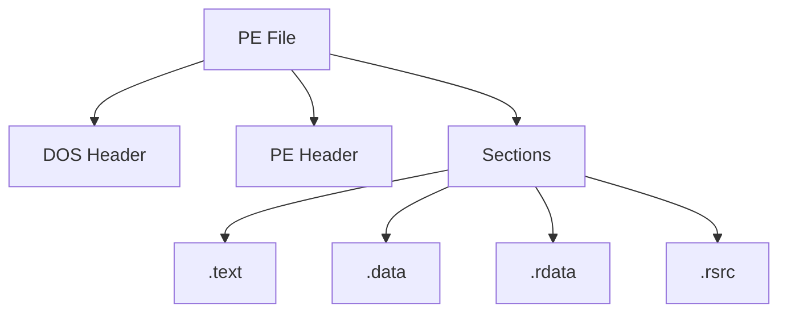

# Week 03 — Binary and PE File Structure

---

# Ringkasan

Pada pertemuan ketiga, saya mempelajari struktur dasar dari file binary, khususnya format **Portable Executable (PE)** yang digunakan oleh sistem operasi Windows. Materi ini sangat penting dalam Reverse Engineering karena sebagian besar executable Windows seperti `.exe` dan `.dll` menggunakan format PE.

Pembelajaran minggu ini berfokus pada pemahaman bagaimana sebuah binary disusun, bagian-bagian utama dalam file PE, serta informasi apa saja yang dapat diperoleh melalui analisis struktur file. Dari materi ini saya mulai memahami bahwa sebelum menganalisis logic program, memahami struktur binary adalah langkah awal yang sangat penting.

---

# Pembahasan Materi

## 1. Binary File

Binary file adalah file yang berisi data dalam format biner yang dapat dibaca dan dieksekusi oleh komputer. Berbeda dengan source code yang mudah dibaca manusia, binary file berisi instruksi dalam bentuk machine code yang langsung dipahami oleh processor.

Secara umum, proses perubahan source code menjadi binary dapat digambarkan sebagai berikut:

```text id="wk3a11"
Source Code
     │
     │ Compile
     ▼
Binary / Executable
     │
     │ Execute
     ▼
Program Running
```

Dalam Reverse Engineering, binary menjadi objek utama analisis karena dari file inilah kita mencoba memahami bagaimana program bekerja.

---

## 2. Portable Executable (PE)

Portable Executable atau PE adalah format file executable standar pada sistem operasi Windows.

Beberapa file yang menggunakan format PE antara lain:

* `.exe`
* `.dll`
* `.sys`

Format PE menyimpan berbagai informasi penting mengenai executable, termasuk:

* Header file
* Entry point
* Section
* Import table
* Export table
* Resource

Informasi ini sangat berguna dalam proses reverse engineering maupun malware analysis.

---

## 3. Struktur Dasar PE File

Secara umum, PE file terdiri dari beberapa bagian utama.

```text id="wk3b22"
PE File Structure
│
├── DOS Header
├── PE Header
├── Optional Header
├── Section Table
│
├── .text
├── .data
├── .rdata
├── .rsrc
└── .reloc
```

Setiap bagian memiliki fungsi yang berbeda dalam executable.

---

## 4. DOS Header

DOS Header merupakan bagian pertama dari file PE. Header ini berisi metadata awal yang digunakan untuk memastikan file dikenali sebagai executable Windows.

Salah satu signature penting pada DOS Header adalah:

```text id="wk3c33"
MZ
```

Signature ini menjadi indikator awal bahwa file tersebut kemungkinan merupakan executable Windows.

---

## 5. PE Header

PE Header berisi informasi utama mengenai executable.

Informasi yang biasanya ditemukan di bagian ini meliputi:

* Architecture
* Number of sections
* Timestamp
* Entry point
* Size of image

PE Header membantu analyst memahami karakteristik dasar binary yang sedang dianalisis.

---

## 6. Sections

Section adalah bagian-bagian dalam PE file yang digunakan untuk menyimpan data tertentu.

Beberapa section yang umum ditemukan antara lain:

| Section  | Fungsi                     |
| -------- | -------------------------- |
| `.text`  | Menyimpan executable code  |
| `.data`  | Menyimpan global variables |
| `.rdata` | Menyimpan read-only data   |
| `.rsrc`  | Menyimpan resources        |
| `.reloc` | Menyimpan relocation data  |

Saya mulai memahami bahwa setiap section memiliki peran berbeda dan dapat memberikan insight penting dalam analisis binary.

---

## 7. Import Table

Import Table berisi daftar library dan function yang digunakan oleh executable.

Contoh library yang sering ditemukan:

* `KERNEL32.dll`
* `USER32.dll`
* `ADVAPI32.dll`

Dari import table, analyst dapat memperoleh gambaran mengenai kemampuan program.

Contohnya:

* Jika ada function file handling → program memanipulasi file
* Jika ada registry function → program mengakses registry
* Jika ada network function → program melakukan komunikasi jaringan

Import table menjadi salah satu sumber informasi penting dalam static analysis.

---

# Diagram Struktur PE File



---

# Insight Minggu Ini

Dari materi minggu ini, saya memahami bahwa analisis terhadap struktur binary adalah langkah penting sebelum masuk ke analisis yang lebih mendalam. Dengan memahami format PE, saya dapat mengetahui bagaimana executable disusun dan bagian mana yang penting untuk dianalisis.

Saya juga mulai memahami bahwa hanya dari struktur file saja, kita sudah bisa mendapatkan banyak informasi awal mengenai perilaku sebuah program.

---

# Tools yang Dipelajari

* PE-bear
* Detect It Easy
* HxD
* IDA Free

---

# Refleksi Pembelajaran

## Apa yang Saya Pahami

Setelah mempelajari materi minggu ini, saya memahami bahwa binary merupakan representasi executable dari source code yang sudah dikompilasi. Saya juga memahami bahwa format PE memiliki struktur yang terorganisasi dengan baik dan terdiri dari berbagai komponen penting.

Selain itu, saya mulai memahami fungsi dari beberapa section utama seperti `.text`, `.data`, dan `.rdata`, serta pentingnya import table dalam memberikan gambaran mengenai kapabilitas program.

## Apa yang Masih Membingungkan

Saya masih ingin memahami lebih dalam bagaimana section-section tersebut digunakan saat program dieksekusi di memory. Selain itu, saya juga masih ingin mempelajari bagaimana cara mengidentifikasi section yang mencurigakan pada malware atau packed binary.

## Kesimpulan Pribadi

Materi minggu ketiga memberikan pemahaman penting mengenai struktur internal executable Windows. Dengan memahami format PE dan komponen-komponennya, saya memiliki fondasi yang lebih kuat untuk melakukan analisis binary secara lebih mendalam pada materi berikutnya.

---
