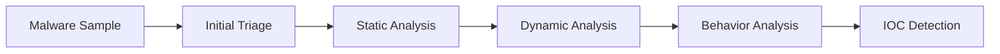

# Week 05 — Malware Analysis Workflow

---

# Ringkasan

Pada pertemuan minggu kelima, saya mempelajari workflow dasar dalam melakukan malware analysis sebagai bagian dari penerapan Reverse Engineering di bidang cybersecurity. Materi ini berfokus pada tahapan analisis malware secara sistematis, mulai dari initial triage hingga penarikan kesimpulan berdasarkan hasil observasi.

Pembelajaran minggu ini menjadi jembatan penting antara teori Reverse Engineering dan praktik analisis malware yang lebih kompleks. Saya mulai memahami bahwa analisis malware tidak hanya sekadar membongkar binary, tetapi juga membutuhkan workflow yang terstruktur agar hasil analisis dapat dipertanggungjawabkan.

---

# Pembahasan Materi

## 1. Apa Itu Malware Analysis?

Malware Analysis adalah proses mempelajari software berbahaya untuk memahami cara kerja, tujuan, serta dampaknya terhadap sistem yang terinfeksi.

Tujuan utama malware analysis antara lain:

* Mengidentifikasi perilaku malware
* Menentukan tingkat ancaman
* Menemukan indikator kompromi (IOC)
* Mendukung incident response
* Membantu proses mitigasi

Dalam dunia cybersecurity, malware analysis memiliki peran yang sangat penting karena membantu analyst memahami ancaman secara lebih mendalam.

---

## 2. Tahapan Malware Analysis

Secara umum, malware analysis dilakukan melalui beberapa tahapan yang saling berkaitan.

Workflow sederhananya dapat digambarkan sebagai berikut:

```text id="wk5a11"
Malware Sample
      │
      ▼
Initial Triage
      │
      ▼
Static Analysis
      │
      ▼
Dynamic Analysis
      │
      ▼
Behavior Analysis
      │
      ▼
IOC Detection
```

Setiap tahapan memiliki tujuan yang berbeda dalam proses analisis.

---

## 3. Initial Triage

Initial triage merupakan tahap pertama dalam malware analysis.

Pada tahap ini, analyst mengumpulkan informasi awal dari sample tanpa menjalankannya.

Informasi yang biasanya dikumpulkan:

* File name
* File type
* File size
* Hash
* Architecture
* Packing status

Tools yang umum digunakan pada tahap ini:

* CertUtil / sha256sum
* Detect It Easy
* PE-bear

Tahap ini penting untuk mendapatkan gambaran awal mengenai sample yang akan dianalisis.

---

## 4. Static Analysis

Static analysis dilakukan tanpa mengeksekusi malware.

Fokus analisis pada tahap ini biasanya meliputi:

* Strings analysis
* Import table
* PE structure
* Function analysis

Informasi yang didapat dari static analysis dapat membantu analyst memprediksi perilaku malware.

Contohnya:

* Import network function → indikasi komunikasi jaringan
* Import registry function → indikasi registry modification
* Import file function → indikasi manipulasi file

Static analysis membantu mengurangi risiko karena malware tidak dijalankan secara langsung.

---

## 5. Dynamic Analysis

Dynamic analysis dilakukan dengan menjalankan malware di lingkungan yang aman.

Lingkungan yang digunakan biasanya berupa:

* Virtual Machine
* Sandbox
* Isolated Lab

Tujuan utama dynamic analysis:

* Mengamati perilaku runtime
* Monitoring aktivitas sistem
* Validasi hasil static analysis

Aktivitas yang diamati antara lain:

* Process creation
* File changes
* Registry changes
* Network activity

Dynamic analysis membantu memahami perilaku nyata malware ketika aktif.

---

## 6. IOC (Indicators of Compromise)

Setelah analisis selesai, hasil observasi biasanya dirangkum dalam bentuk IOC.

Contoh IOC:

* File hash
* Domain/IP mencurigakan
* Registry key
* Process name
* File path

IOC sangat penting untuk membantu proses deteksi dan mitigasi pada sistem lain yang berpotensi terinfeksi.

---

# Diagram Malware Analysis Workflow



---

# Insight Minggu Ini

Dari materi minggu ini, saya memahami bahwa malware analysis merupakan proses yang sistematis dan membutuhkan pendekatan yang terstruktur. Setiap tahapan analisis memiliki tujuan tertentu dan saling melengkapi untuk menghasilkan pemahaman yang lebih akurat mengenai malware.

Saya juga mulai memahami pentingnya lingkungan analisis yang aman agar proses observasi dapat dilakukan tanpa membahayakan sistem utama.

---

# Tools yang Dipelajari

* CertUtil
* Detect It Easy
* PE-bear
* Ghidra
* Wireshark
* Process Monitor

---

# Refleksi Pembelajaran

## Apa yang Saya Pahami

Setelah mempelajari materi minggu ini, saya memahami bahwa malware analysis adalah proses yang terdiri dari beberapa tahapan yang terstruktur. Saya memahami pentingnya initial triage untuk mengumpulkan informasi awal, static analysis untuk membaca struktur internal malware, serta dynamic analysis untuk mengamati perilaku runtime.

Saya juga memahami bahwa hasil analisis biasanya dirangkum dalam bentuk IOC yang dapat digunakan untuk mendukung proses deteksi dan mitigasi ancaman.

## Apa yang Masih Membingungkan

Saya masih ingin memahami lebih dalam bagaimana malware modern menggunakan teknik anti-analysis seperti obfuscation, anti-debugging, dan anti-VM untuk menghindari deteksi.

## Kesimpulan Pribadi

Materi minggu kelima memberikan pemahaman penting mengenai workflow dasar malware analysis. Materi ini menjadi fondasi yang sangat berguna sebelum masuk ke studi kasus analisis malware secara langsung pada pertemuan berikutnya.

---

