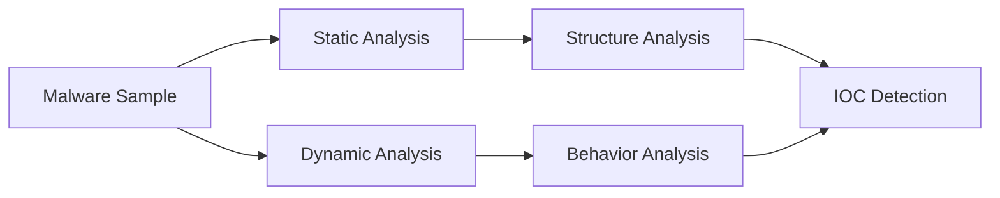

# Week 06 — Malware Analysis Case Study: WannaCry

---

# Ringkasan

Pada pertemuan minggu keenam, saya mulai mempelajari penerapan Reverse Engineering secara lebih praktis melalui analisis malware. Materi kali ini berfokus pada bagaimana proses analisis malware dilakukan menggunakan kombinasi static analysis dan dynamic analysis untuk memahami perilaku program berbahaya.

Studi kasus yang digunakan pada minggu ini adalah ransomware **WannaCry**, salah satu malware terkenal yang sempat menyebabkan serangan global pada tahun 2017. Melalui analisis ini, saya mulai memahami bagaimana malware dapat dianalisis untuk mengidentifikasi perilaku, kemampuan, serta dampaknya terhadap sistem.

---

# Pembahasan Materi

## 1. Apa Itu Malware Analysis?

Malware Analysis adalah proses mempelajari software berbahaya untuk memahami:

* Cara kerja malware
* Tujuan malware
* Teknik serangan
* Dampak terhadap sistem

Tujuan utama dari malware analysis adalah untuk mengidentifikasi ancaman, memahami perilaku malware, serta membantu proses mitigasi dan incident response.

Dalam praktiknya, malware analysis biasanya menggunakan dua pendekatan utama:

* Static Analysis
* Dynamic Analysis

Kedua metode tersebut digunakan untuk mendapatkan pemahaman yang lebih lengkap terhadap malware.

---

## 2. Mengenal WannaCry

WannaCry adalah ransomware yang menyerang sistem operasi Windows dengan mengenkripsi file korban dan meminta tebusan dalam bentuk cryptocurrency.

Secara umum, alur serangan WannaCry adalah sebagai berikut:

```text id="wk6a11"
System Infection
      │
      ▼
Exploit Vulnerability
      │
      ▼
Payload Execution
      │
      ▼
File Encryption
      │
      ▼
Ransom Demand
```

WannaCry menjadi salah satu contoh malware yang menarik untuk dianalisis karena menunjukkan kombinasi antara eksploitasi vulnerability, persistence mechanism, dan enkripsi file.

---

## 3. Static Analysis pada WannaCry

Dalam static analysis, saya mempelajari struktur binary tanpa menjalankan malware secara langsung.

Beberapa hal yang dianalisis antara lain:

* File structure
* Strings
* Import table
* Function references

Dari hasil analisis awal, ditemukan beberapa indikator penting yang menunjukkan karakteristik ransomware.

Beberapa string yang menarik antara lain:

* `.WNCRY`
* `taskse.exe`
* `mssecsvc.exe`

String-string tersebut mengindikasikan bahwa malware memiliki komponen yang berhubungan dengan proses enkripsi file serta service execution.

---

## 4. Import Analysis

Import table memberikan gambaran mengenai kemampuan malware berdasarkan library dan function yang digunakan.

Beberapa library yang ditemukan antara lain:

* `KERNEL32.dll`
* `USER32.dll`
* `ADVAPI32.dll`
* `MSVCRT.dll`

Function yang menarik untuk dianalisis antara lain:

* `CreateServiceA()`
* `OpenServiceA()`
* `StartServiceA()`
* `fopen()`
* `fread()`
* `fwrite()`

Dari function-function tersebut, saya memahami bahwa malware ini memiliki kemampuan untuk:

* Membuat service baru
* Mengakses service Windows
* Memanipulasi file
* Membaca dan menulis data

Hal ini menunjukkan adanya mekanisme persistence serta aktivitas manipulasi file yang kuat.

---

## 5. Dynamic Analysis pada WannaCry

Selain static analysis, saya juga mempelajari perilaku malware melalui dynamic analysis di lingkungan yang aman.

Tahapan dynamic analysis yang dilakukan meliputi:

1. Persiapan virtual environment
2. Eksekusi malware
3. Monitoring aktivitas sistem
4. Analisis aktivitas jaringan
5. Dokumentasi hasil analisis

Beberapa perilaku yang diamati antara lain:

* Perubahan file system
* Aktivitas service
* Modifikasi registry
* Aktivitas jaringan mencurigakan

Dynamic analysis membantu memvalidasi hasil temuan dari static analysis.

---

## 6. IOC (Indicators of Compromise)

Dari hasil analisis, ditemukan beberapa indikator kompromi yang relevan.

IOC yang teridentifikasi antara lain:

* Enkripsi file korban
* Perubahan registry
* Pembuatan service baru
* Aktivitas network mencurigakan
* Perubahan file system

IOC ini menjadi indikator penting untuk mendeteksi aktivitas malware pada sistem yang terinfeksi.

---

# Diagram Malware Analysis Workflow



---

# Insight Minggu Ini

Dari materi minggu ini, saya memahami bahwa malware analysis merupakan salah satu penerapan penting dari Reverse Engineering dalam bidang cybersecurity. Melalui analisis malware, saya dapat memahami bagaimana sebuah malware bekerja, apa tujuannya, dan bagaimana ancaman tersebut dapat dideteksi.

Studi kasus WannaCry membantu saya melihat bagaimana kombinasi static analysis dan dynamic analysis dapat digunakan untuk menghasilkan pemahaman yang lebih mendalam terhadap suatu malware.

---

# Tools yang Dipelajari

* Ghidra
* PE-bear
* Wireshark
* Process Monitor
* VirtualBox

---

# Refleksi Pembelajaran

## Apa yang Saya Pahami

Setelah mempelajari materi minggu ini, saya memahami bahwa malware analysis adalah proses yang kompleks dan membutuhkan kombinasi berbagai teknik analisis. Saya juga memahami bahwa static analysis membantu membaca struktur internal malware, sedangkan dynamic analysis membantu melihat perilaku malware saat dijalankan.

Saya mulai memahami bagaimana indikator seperti strings, import table, dan system activity dapat digunakan untuk mengidentifikasi karakteristik malware.

## Apa yang Masih Membingungkan

Saya masih ingin memahami lebih dalam bagaimana malware modern menggunakan teknik obfuscation atau anti-analysis untuk menghindari deteksi. Selain itu, saya juga ingin mempelajari teknik analisis malware yang lebih kompleks pada level memory dan runtime behavior.

## Kesimpulan Pribadi

Materi minggu keenam memberikan pengalaman yang sangat menarik karena saya mulai melihat penerapan langsung Reverse Engineering dalam analisis malware. Studi kasus WannaCry membantu saya memahami bahwa Reverse Engineering memiliki peran besar dalam mendeteksi, memahami, dan merespons ancaman keamanan siber.

---

