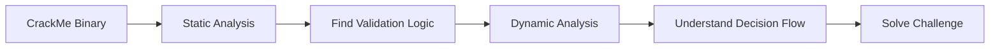

# Week 07 — CrackMe Analysis and Basic Binary Reversing

---

# Ringkasan

Pada pertemuan minggu ketujuh, saya mulai mempelajari praktik Reverse Engineering melalui analisis **CrackMe**. CrackMe adalah program kecil yang sengaja dibuat untuk melatih kemampuan analisis binary, debugging, dan understanding logic program.

Materi minggu ini berfokus pada bagaimana memahami alur autentikasi program, menemukan validasi input, serta menganalisis logic yang menentukan apakah input pengguna dianggap benar atau salah. Dari pembelajaran ini saya mulai memahami bagaimana teknik Reverse Engineering digunakan untuk membongkar logic internal sebuah program executable.

---

# Pembahasan Materi

## 1. Apa Itu CrackMe?

CrackMe adalah executable yang dirancang khusus untuk tujuan pembelajaran Reverse Engineering. Program ini biasanya memiliki challenge tertentu, misalnya:

* Menemukan password
* Bypass authentication
* Memahami validation logic
* Mencari hidden flag

Tujuan utama dari CrackMe bukan merusak software, melainkan melatih kemampuan analisis binary secara legal dan terstruktur.

Secara sederhana alur CrackMe dapat digambarkan sebagai berikut:

```text id="wk7a11"
User Input
    │
    ▼
Validation Logic
    │
 ┌──┴──┐
 │     │
True  False
 │     │
 ▼     ▼
Access Denied / Granted
```

Challenge utama dalam CrackMe adalah memahami bagaimana validation logic tersebut bekerja.

---

## 2. Tahapan Analisis CrackMe

Dalam menganalisis CrackMe, terdapat beberapa langkah yang umumnya dilakukan.

### Initial Triage

Tahap awal adalah mengumpulkan informasi dasar dari executable.

Hal yang biasanya dicek:

* File type
* Architecture
* Strings
* Imports
* Packing status

Tahap ini membantu menentukan strategi analisis berikutnya.

---

### Static Analysis

Pada tahap ini executable dianalisis tanpa dijalankan.

Fokus utama biasanya pada:

* Function analysis
* Strings analysis
* Cross references
* Authentication logic

Static analysis membantu menemukan bagian code yang kemungkinan berhubungan dengan proses validasi input.

---

### Dynamic Analysis

Setelah mendapat gambaran awal, program dijalankan menggunakan debugger.

Tujuan dynamic analysis:

* Melihat alur program saat runtime
* Memahami conditional branching
* Mengamati input validation
* Menentukan decision point

Dynamic analysis sangat membantu dalam memahami flow program secara nyata.

---

## 3. Authentication Logic

Salah satu fokus utama dalam CrackMe adalah memahami authentication logic.

Contoh logic sederhana:

```c
if(password == "admin123") {
    access_granted();
}
else {
    access_denied();
}
```

Pada level binary, logic seperti ini biasanya diterjemahkan menjadi:

* Compare instruction
* Conditional jump
* Branch execution

Contoh alur sederhananya:

```text id="wk7b22"
Input
  │
  ▼
Compare
  │
 ┌┴┐
 │ │
EQ NE
 │ │
 ▼ ▼
OK FAIL
```

Dari sini saya mulai memahami bahwa banyak challenge CrackMe sebenarnya berpusat pada bagaimana memahami conditional logic.

---

## 4. Conditional Jump

Dalam binary analysis, conditional jump adalah bagian yang sangat penting.

Instruksi yang umum ditemukan:

* `JE`
* `JNE`
* `JZ`
* `JNZ`

Instruksi-instruksi ini menentukan arah eksekusi program berdasarkan hasil perbandingan sebelumnya.

Sebagai contoh:

* Jika kondisi benar → lompat ke blok sukses
* Jika kondisi salah → lompat ke blok gagal

Memahami conditional jump sangat penting dalam Reverse Engineering.

---

## 5. Tools untuk Analisis CrackMe

Beberapa tools yang digunakan untuk menganalisis CrackMe antara lain:

| Tools    | Fungsi          |
| -------- | --------------- |
| IDA Free | Static Analysis |
| Ghidra   | Decompiler      |
| x64dbg   | Debugging       |
| HxD      | Hex Editing     |

Tools ini membantu analyst memahami logic program secara lebih detail.

---

# Diagram CrackMe Workflow



---

# Insight Minggu Ini

Dari materi minggu ini, saya memahami bahwa CrackMe merupakan media pembelajaran yang sangat efektif untuk melatih kemampuan Reverse Engineering. Melalui challenge seperti ini, saya belajar bagaimana membaca flow program, memahami logic validasi, dan menganalisis branching pada executable.

Saya juga mulai memahami bahwa Reverse Engineering tidak hanya tentang membaca assembly, tetapi juga tentang berpikir logis dan sistematis untuk memahami bagaimana suatu program mengambil keputusan.

---

# Tools yang Dipelajari

* IDA Free
* Ghidra
* x64dbg
* HxD

---

# Refleksi Pembelajaran

## Apa yang Saya Pahami

Setelah mempelajari materi minggu ini, saya memahami bahwa CrackMe merupakan sarana latihan yang sangat baik untuk mengembangkan kemampuan Reverse Engineering. Saya mulai memahami bagaimana authentication logic bekerja dalam executable dan bagaimana branching menentukan alur eksekusi program.

Saya juga memahami bahwa analisis binary membutuhkan kombinasi antara static analysis dan dynamic analysis untuk mendapatkan hasil yang lebih akurat.

## Apa yang Masih Membingungkan

Saya masih ingin memahami lebih dalam bagaimana membaca assembly code dengan lebih cepat dan bagaimana mengenali validation logic yang kompleks pada executable yang lebih besar.

## Kesimpulan Pribadi

Materi minggu ketujuh memberikan pengalaman yang sangat menarik karena saya mulai berlatih memahami logic internal executable secara langsung. Melalui CrackMe, saya semakin memahami pentingnya analytical thinking dalam Reverse Engineering.

---
