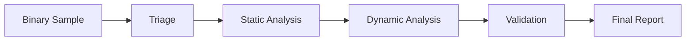

# Week 08 — Advanced Binary Analysis and Final Reflection

---

# Ringkasan

Pada pertemuan minggu kedelapan, saya mempelajari bagaimana seluruh materi Reverse Engineering yang telah dipelajari selama beberapa minggu terakhir saling terhubung dalam proses analisis binary yang lebih kompleks. Materi kali ini lebih berfokus pada penerapan end-to-end workflow, mulai dari initial triage, static analysis, dynamic analysis, hingga penarikan kesimpulan berdasarkan hasil analisis.

Melalui pembelajaran minggu ini, saya mulai melihat gambaran besar mengenai bagaimana Reverse Engineering digunakan dalam dunia nyata, khususnya untuk software analysis, malware analysis, vulnerability research, dan digital forensics. Minggu ini juga menjadi momen refleksi untuk melihat perkembangan pemahaman saya terhadap bidang Reverse Engineering secara keseluruhan.

---

# Pembahasan Materi

## 1. Workflow Analisis Binary Secara Menyeluruh

Dalam praktik nyata, proses Reverse Engineering tidak dilakukan secara acak. Analisis biasanya mengikuti workflow yang sistematis agar hasilnya lebih terstruktur dan akurat.

Secara umum workflow tersebut dapat digambarkan sebagai berikut:

```text id="wk8a11"
Binary Sample
    │
    ▼
Initial Triage
    │
    ▼
Static Analysis
    │
    ▼
Dynamic Analysis
    │
    ▼
Validation
    │
    ▼
Conclusion
```

Workflow ini membantu analyst memahami binary secara bertahap, mulai dari level dasar hingga perilaku runtime.

---

## 2. Initial Triage

Initial triage merupakan tahap awal dalam proses analisis binary.

Tujuan tahap ini adalah mengumpulkan informasi dasar mengenai sample yang akan dianalisis.

Informasi yang biasanya dikumpulkan antara lain:

* File type
* File size
* Hash value
* Architecture
* Packing status
* Strings awal

Tahap ini penting karena dapat membantu menentukan strategi analisis berikutnya.

---

## 3. Static Analysis

Setelah informasi dasar diperoleh, langkah berikutnya adalah melakukan static analysis.

Pada tahap ini analyst mencoba memahami struktur internal binary tanpa menjalankan program.

Fokus static analysis biasanya meliputi:

* PE structure
* Import table
* Strings
* Functions
* Cross references

Dari tahap ini biasanya sudah dapat diperoleh gambaran awal mengenai kemampuan program.

---

## 4. Dynamic Analysis

Dynamic analysis dilakukan dengan menjalankan binary di lingkungan yang aman.

Tujuan utama tahap ini adalah mengamati perilaku program secara langsung.

Hal yang diamati meliputi:

* Process activity
* File system changes
* Registry changes
* Service creation
* Network communication

Dynamic analysis membantu memvalidasi hasil static analysis.

---

## 5. Tantangan dalam Reverse Engineering

Semakin kompleks sebuah binary, semakin sulit pula proses analisisnya.

Beberapa tantangan utama dalam Reverse Engineering antara lain:

* Obfuscation
* Packing
* Encryption
* Anti-debugging
* Anti-VM

Teknik-teknik ini digunakan untuk mempersulit analyst dalam memahami logic internal program.

Saya mulai memahami bahwa Reverse Engineering tidak hanya membutuhkan kemampuan teknis, tetapi juga kesabaran dan analytical thinking yang kuat.

---

## 6. Keterkaitan Semua Materi

Setelah mempelajari seluruh materi selama delapan minggu, saya melihat bahwa setiap topik saling berkaitan.

* Week 01 → Fondasi Reverse Engineering
* Week 02 → Static vs Dynamic Analysis
* Week 03 → Binary dan PE Structure
* Week 04 → Tools Reverse Engineering
* Week 05 → Malware Analysis Workflow
* Week 06 → Studi Kasus Malware
* Week 07 → CrackMe Analysis
* Week 08 → Integrasi seluruh konsep

Dari sini saya memahami bahwa semua materi sebenarnya membentuk satu workflow besar dalam analisis executable.

---

# Diagram Reverse Engineering Workflow



---

# Insight Minggu Ini

Dari materi minggu ini, saya memahami bahwa Reverse Engineering adalah proses analisis yang sangat sistematis. Semua materi yang dipelajari selama semester ini ternyata saling melengkapi dan membentuk workflow yang utuh.

Saya juga menyadari bahwa Reverse Engineering bukan hanya tentang tools atau membaca assembly code, tetapi tentang bagaimana menganalisis suatu program secara logis, sistematis, dan terstruktur.

---

# Tools yang Dipelajari

* IDA Free
* Ghidra
* x64dbg
* PE-bear
* Wireshark
* Process Monitor

---

# Refleksi Pembelajaran

## Apa yang Saya Pahami

Setelah mengikuti pembelajaran selama delapan minggu, saya memahami bahwa Reverse Engineering merupakan proses untuk memahami software dari executable atau binary tanpa source code asli. Saya juga memahami bahwa proses ini membutuhkan kombinasi static analysis, dynamic analysis, tools yang tepat, serta kemampuan analisis yang baik.

Selain itu, saya mulai memahami bagaimana teori yang dipelajari dapat diterapkan dalam analisis nyata seperti malware analysis dan CrackMe analysis.

## Apa yang Masih Membingungkan

Saya masih ingin memperdalam pemahaman mengenai assembly code tingkat lanjut, debugging pada binary yang kompleks, serta teknik bypass terhadap proteksi seperti anti-debugging dan obfuscation.

## Kesimpulan Pribadi

Delapan minggu pembelajaran ini memberikan banyak insight baru mengenai dunia Reverse Engineering. Saya merasa pemahaman saya berkembang dari hanya mengetahui konsep dasar hingga mulai memahami workflow analisis binary secara lebih sistematis. Meskipun masih banyak hal yang perlu dipelajari, saya merasa telah memiliki fondasi yang cukup kuat untuk terus mendalami bidang Reverse Engineering di masa depan.

---
